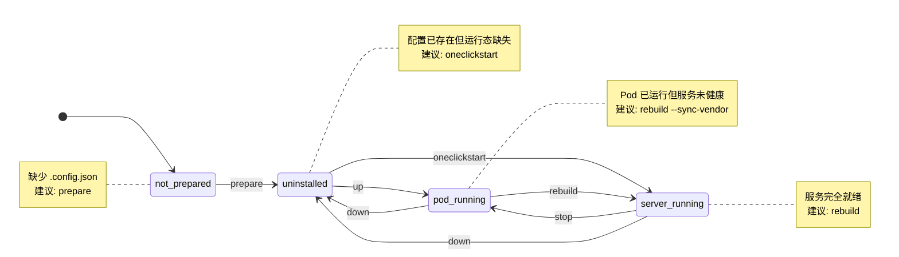

# Nocalhost Environment Control

This skill provides a **stateful, automated** workflow for preparing and operating `${DEPLOYMENT_NAME}` in a Kubernetes test environment using Nocalhost.

This README is supporting material for the routed `nocalhost-environment-control` skill.

## Quick Reference

The `nocalhostctl` tool (located in `.opencode/skills/nocalhost-testing/nocalhost-environment-control/scripts/nocalhostctl/`) manages the entire lifecycle and maintains session state.

```bash
# 0. verify readiness first
ls .nocalhost/.config.json

# 1. only after readiness is proven
go run -tags debug ./.opencode/skills/nocalhost-testing/nocalhost-environment-control/scripts/nocalhostctl status


```

## 1. Prerequisites

- **nocalhost installed**: `npm install -g nocalhost`
- **nhctl CLI** (comes with nocalhost)
- **Go modules vendored locally**: run `go mod vendor` before starting
- **Kubeconfig**: `~/.kube/${NAMESPACE}_kubeconfig`

## 2. Status State Machine

`status` is read-only. It reports the current state and suggests the next action.



State meaning:
- `not_prepared`: `.nocalhost/.config.json` is missing or invalid, suggest `prepare`
- `uninstalled`: config exists, but no runtime state or pod is present, suggest `oneclickstart`
- `pod_running`: pod exists but the server heartbeat is not healthy yet, suggest `rebuild --sync-vendor`
- `server_running`: the service is healthy, suggest `rebuild`

## 3. Workflow

### Step 0: Collect Inputs And Prepare Configuration

Save required configuration parameters:

```bash
go run -tags debug ./.opencode/skills/nocalhost-testing/nocalhost-environment-control/scripts/nocalhostctl prepare \
  --developer-name="your-account-username" \
  --kubeconfig=~/.kube/${NAMESPACE}_kubeconfig
```

Do not continue to startup until the generated config and helper scripts are validated, the prepare checklist passes, and any uncertain derived values are confirmed.

### Step 1: Initialize Dev Environment

Only after readiness is proven.

This command installs the application (if needed) and starts dev mode in **duplicate mode**. It captures the pod name and saves it to a local `.state.json` file.

```bash
go run -tags debug ./.opencode/skills/nocalhost-testing/nocalhost-environment-control/scripts/nocalhostctl up
```

### Step 2: First-Time Setup (Sync, Build, Run)

**For first-time setup only**, run these commands sequentially to start the server:

1. **Sync**: Copy files to the pod (including `vendor` if --sync-vendor is used)
```bash
go run -tags debug ./.opencode/skills/nocalhost-testing/nocalhost-environment-control/scripts/nocalhostctl sync --sync-vendor
```

2. **Build**: Build the binary inside the pod using `go build -mod=vendor`
```bash
go run -tags debug ./.opencode/skills/nocalhost-testing/nocalhost-environment-control/scripts/nocalhostctl build
```

3. **Run**: Start the server using the `startup.sh` script inside the pod
```bash
go run -tags debug ./.opencode/skills/nocalhost-testing/nocalhost-environment-control/scripts/nocalhostctl run
```

### Step 3: Incremental Development (Rebuild)

**After first-time setup**, use this command when you change your code. It will:
1. **Sync**: Copy modified files to the pod (excluding `vendor`, `.git`, etc.)
2. **Build**: Build binary inside the pod using `go build -mod=vendor`.
3. **Run**: Restart the server using `startup.sh` script inside the pod.

**Important**: The build command uses `-mod=vendor` which requires the vendor directory. Use `--sync-vendor` flag to include it:

```bash
go run -tags debug ./.opencode/skills/nocalhost-testing/nocalhost-environment-control/scripts/nocalhostctl rebuild --sync-vendor
```

**Note**: For subsequent rebuilds after the first vendor sync, you can omit `--sync-vendor` for faster sync:
```bash
go run -tags debug ./.opencode/skills/nocalhost-testing/nocalhost-environment-control/scripts/nocalhostctl rebuild
```

### Step 4: Monitor Logs

Tail the server log inside the pod:

```bash
go run -tags debug ./.opencode/skills/nocalhost-testing/nocalhost-environment-control/scripts/nocalhostctl logs
```

### Step 5: Port Forward

Expose the server locally (defaults to localhost:8092):

```bash
go run -tags debug ./.opencode/skills/nocalhost-testing/nocalhost-environment-control/scripts/nocalhostctl forward
```

### Step 6: Cleanup

Stop dev mode and uninstall the application:

```bash
go run -tags debug ./.opencode/skills/nocalhost-testing/nocalhost-environment-control/scripts/nocalhostctl down
```

## 4. Running Tests

### Generate Test Cases

Use the **nocalhost-test-management** skill:
```
User: "Generate test cases for controller/cloud.go GetHistory"
Skill: Creates YAML at tests/nocalhost-test/cloud/pod_history.yaml
```

### Execute Tests

When running in a subagent context, provide this tip to the main agent:

"Execute tests using the nocalhost-test-execution skill by running:
go run -tags debug ./.opencode/skills/nocalhost-testing/nocalhost-test-execution/scripts/runner.go \
  --url=http://localhost:8092 \
  --group=cloud \
  --user=<developer-name-from-prepare>"

The main agent will execute this command.

## 5. Troubleshooting

| Issue | Solution |
|-------|----------|
| `Configuration not found` | Run `prepare` command first with required parameters. |
| `State not found` | If config exists, run `oneclickstart`; otherwise run `prepare`. |
| `Pod not found` | Your pod might have been deleted. Run `up` again to re-discover. |
| `Build failed` | Ensure dependencies are correct in go.mod. The script auto-runs `go mod vendor` when using `--sync-vendor`. |
| `Build failed: missing vendor directory` | Use `--sync-vendor` flag with rebuild command. Build uses `-mod=vendor` which requires vendor directory. |
| `401 errors` | Check if DEVELOPER_NAME was set correctly in prepare command. |

## 6. Directory Structure

All skill-specific tools are self-contained in:
`.opencode/skills/nocalhost-testing/nocalhost-environment-control/`
├── `configs/`
│   ├── `app.yaml`        # Nocalhost app config
│   └── `config.yaml`     # Nocalhost service config
├── `scripts/`
│   ├── `nocalhostctl/`   # Go orchestrator (main.go)
│   └── `startup.sh`      # Inside-pod entrypoint
└── `SKILL.md`            # This documentation
