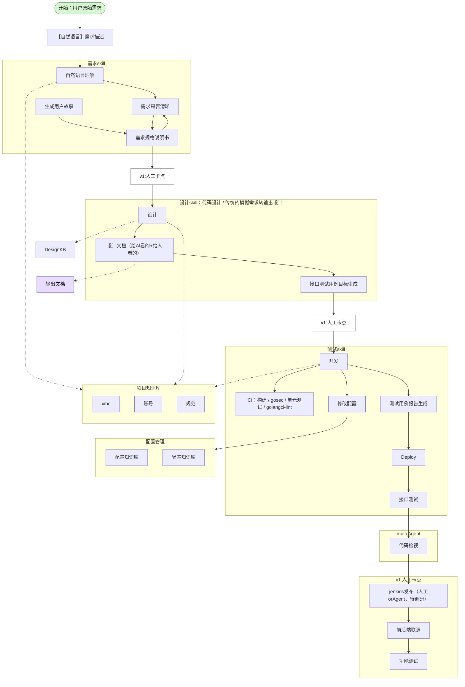

# ai-native-explore
AI Native Explore

## 流程梳理

```mermaid
flowchart TB
  Start([开始：用户原始需求]):::start --> NL[【自然语言】需求描述] --> NLU[自然语言理解]

  subgraph Req["需求skill"]
    direction TB
    US[生成用户故事]
    Clear[需求是否清晰]
    Spec[需求规格说明书]
    US --> Spec
    NLU --> Clear --> Spec
    Spec --> Clear
  end

  Spec --> Gate1["v1:人工卡点"]:::gate --> Design

  subgraph DesignBox["设计skill：代码设计 / 传统的模糊需求转输出设计"]
    direction TB
    Design[设计]
    DDoc[设计文档（给AI看的+给人看的）]
    ITC[接口测试用例目标生成]
    Design --> DDoc --> ITC
  end

  ITC --> Gate2["v1:人工卡点"]:::gate --> Dev

  subgraph TestBox["测试skill"]
    direction TB
    Dev[开发]
    CI["CI：构建 / gosec / 单元测试 / golangci-lint"]
    TGen[测试用例报告生成]
    Report[接口测试]
    ConfChange[修改配置]

    Dev --> CI
    Dev --> TGen --> Deploy --> Report
    Dev --> ConfChange
  end

  subgraph Multi["multi Agent"]
    direction TB
    Review[代码检视]
  end

  Report --> Review

  subgraph V1["v1:人工卡点"]
    direction TB
    Jenkins["jenkins发布（人工orAgent，待调研）"]
    FEBE[前后端联调]
    Func[功能测试]
    Jenkins --> FEBE --> Func
  end

  Review --> Jenkins

  subgraph Knowledge["项目知识库"]
    direction TB
    xihe[xihe]
    mcp[账号]
    rule[规范]
  end


  Out[输出文档]:::doc

  subgraph Config["配置管理"]
    direction TB
    CKB1[配置知识库]
    CKB2[配置知识库]
  end

  NLU -.-> Knowledge
  Design -.-> Knowledge
  Dev -.-> Knowledge
  Design -.-> DesignKB
  DDoc -.-> Out
  ConfChange --> Config


  classDef start fill:#d8f5d1,stroke:#58a55c,stroke-width:1px,color:#000;
  classDef gate fill:#ffffff,stroke:#999,stroke-width:1px,color:#000;
  classDef doc fill:#e8ddff,stroke:#8a6fd1,stroke-width:1px,color:#000;
  classDef sec fill:#ffd8d8,stroke:#d46a6a,stroke-width:1px,color:#000;
```