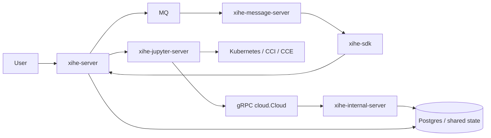
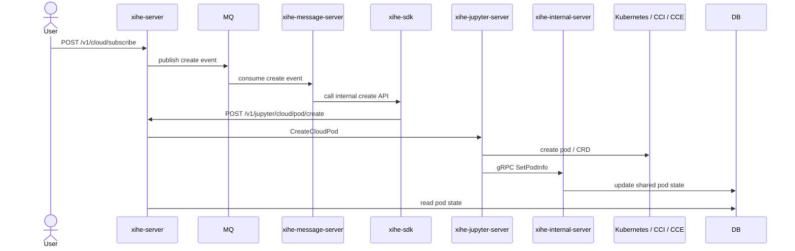
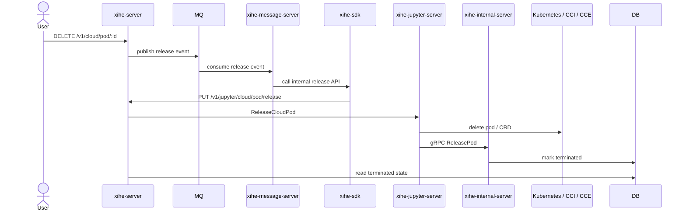

# Jupyter Cloud Architecture

## Overview

The cloud flow has two paths:

1. Command path:
   `xihe-server` external API -> MQ -> `xihe-message-server` -> `xihe-sdk` -> `xihe-server` internal API -> `xihe-jupyter-server` -> Kubernetes / operator

2. Callback path:
   `xihe-jupyter-server` -> gRPC -> `xihe-internal-server` (cloud.Cloud service) -> shared `xihe-server` cloud packages + Postgres state

The create/release path is asynchronous through MQ. The pod status callback path is asynchronous through gRPC.

## Mermaid Diagrams

### Architecture

### Subscribe Flow

### Release Flow

## Architecture

### `xihe-server`
Current project and external API entrypoint.

Responsibilities:
- expose external cloud APIs
- validate user and subscription rules
- persist pod records
- publish cloud create/release events to MQ
- expose internal HTTP APIs for message-server
- expose websocket / HTTP APIs for pod state

Verified APIs:
- `POST /v1/cloud/subscribe`
- `GET /v1/cloud/:cid` (websocket)
- `GET /v1/cloud/pod/:cid`
- `DELETE /v1/cloud/pod/:id`
- `GET /v1/ws/cloud/pod/:id`
- `GET /v1/cloud/pod/history`
- `POST /v1/jupyter/cloud/pod/create`
- `PUT /v1/jupyter/cloud/pod/release`

### `xihe-message-server`
MQ consumer and dispatcher.

Responsibilities:
- subscribe cloud create/release topics
- deserialize MQ payloads
- call `xihe-server` internal HTTP APIs through `xihe-sdk`

Important:
- it does not talk to `xihe-internal-server` directly in this flow

### `xihe-sdk`
HTTP client used by `xihe-message-server`.

It calls:
- `POST /v1/jupyter/cloud/pod/create`
- `PUT /v1/jupyter/cloud/pod/release`

### `xihe-jupyter-server`
Kubernetes / CCI / CCE pod manager.

Responsibilities:
- create cloud pod / CRD
- delete cloud pod / CRD
- watch pod state
- report state back by gRPC

### `xihe-internal-server`
gRPC callback receiver.

Responsibilities:
- receive pod result callbacks from `xihe-jupyter-server`
- update pod status / access URL / error / terminated state

Implementation note:
- `xihe-internal-server` starts a gRPC server through `xihe-grpc-protocol/grpc/server`
- `cloudServer.SetPodInfo` maps gRPC `SetPodInfo` into pod info updates
- `cloudServer.ReleasePod` maps gRPC `ReleasePod` into terminated-state updates
- it does not call `xihe-server` over HTTP; it updates the same Postgres-backed cloud state using shared `xihe-server` cloud app/domain/repository packages

Verification scope:
- the `xihe-internal-server` behavior above is verified from the adjacent repo `../xihe-internal-server`
- the `xihe-jupyter-server` callback behavior is verified from the adjacent repo `../xihe-jupyter-server`
- the `xihe-server` HTTP and storage behavior is verified from this repo

### `xihe-grpc-protocol`
Defines the gRPC contract between `xihe-jupyter-server` and `xihe-internal-server`.

Relevant RPCs:
- `SetPodInfo`
- `ReleasePod`

## Data Flow

### Subscribe

1. User calls `POST /v1/cloud/subscribe` on `xihe-server`.
2. `xihe-server` validates the request and stores a starting pod record.
3. `xihe-server` publishes a create message to MQ.
4. `xihe-message-server` consumes the message.
5. `xihe-message-server` calls `xihe-server` internal API through `xihe-sdk`.
6. `xihe-server` internal API delegates to the jupyter SDK.
7. `xihe-jupyter-server` creates the pod / CRD in Kubernetes or CCI.
8. `xihe-jupyter-server` watchers observe the workload state.
9. `xihe-jupyter-server` reports pod info to `xihe-internal-server` via gRPC `SetPodInfo`.
10. `xihe-internal-server` updates the shared Postgres-backed cloud tables used by `xihe-server`.

### Release

1. User calls `DELETE /v1/cloud/pod/:id` on `xihe-server`.
2. `xihe-server` marks the pod terminating and publishes a release message to MQ.
3. `xihe-message-server` consumes the release message.
4. `xihe-message-server` calls `xihe-server` internal release API through `xihe-sdk`.
5. `xihe-server` internal release API delegates to the jupyter SDK.
6. `xihe-jupyter-server` deletes the pod / CRD.
7. Watchers detect the terminating pod and report release state through gRPC.
8. `xihe-internal-server` marks the pod terminated after applying the termination wait window.
9. `xihe-server` exposes the final state through HTTP or websocket APIs after reading the updated shared storage.

## Deploy Config Mapping

Relevant files in the adjacent repo `../deploy/xihe`:

1. `server.tpl` - `xihe-server`
2. `message-server.tpl` - `xihe-message-server`
3. `internal-server.tpl` - `xihe-internal-server`
4. `inference-evaluate.tpl` - `xihe-jupyter-server`

## Key Verification Notes

- `xihe-server/cloud/app/cloud.go` publishes create/release events to MQ.
- `xihe-message-server/cloud/subscriber.go` consumes those messages.
- `xihe-sdk/cloud/api/api.go` calls internal HTTP endpoints on `xihe-server`.
- `xihe-server/cloud/controller/cloud_internal.go` receives those internal calls.
- `xihe-server/cloud/app/message.go` delegates create/release to `xihe-jupyter-server` SDK.
- `xihe-jupyter-server/controller/cloud.go` performs actual pod creation / deletion.
- `xihe-jupyter-server/watch/watchimpl/*` reports pod status changes.
- `xihe-internal-server/main.go` handles gRPC callbacks and updates cloud pod state.
- `xihe-grpc-protocol/proto/cloud.proto` defines the callback contract.

Identifier detail:
- subscribe is keyed by `cloud_id`
- subscribe creates a new `pod_id` and carries both `pod_id` and `cloud_id` through MQ and the internal create request
- release is keyed by `pod_id`
- internal release uses `pod_id` plus `cloud_type`, not `cloud_id`

Operational caveat:
- release is not immediate; the shared cloud internal logic in `xihe-server/cloud/app/internal.go` moves expiry forward by `terminationWait` before marking the pod terminated
- websocket reads can wait up to `PodTimeout`

## Important Distinction

- `cloud_id` identifies the cloud config.
- `pod_id` identifies the created pod.
- subscribe starts from `cloud_id`.
- subscribe creates and propagates both `cloud_id` and `pod_id`.
- release operates on `pod_id` plus `cloud_type`.
